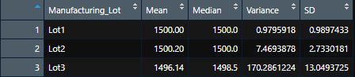
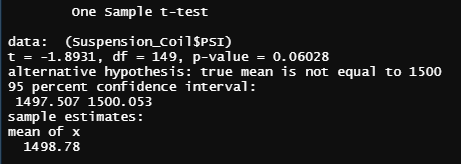
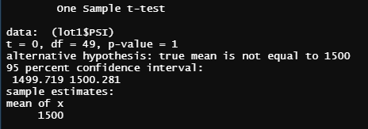
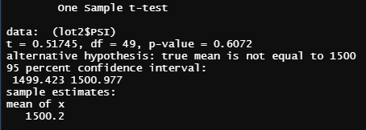
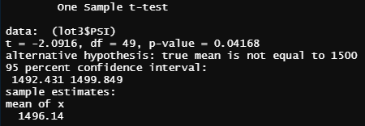

# MechaCar Statistical Analysis
Columbia Data Science Module 15

## Overview
In this project, I have used R Studio to analyze manufacturing data for MechaCar. I analyzed: 
1) which features of car design influence average mileage per gallon; 
2) whether suspension coils across three production lots were produced to specifications.

After that, I finished up by creating a summary of an experimental design that may be used to determine the average sticker price of MechaCar's vehicles compared to their largest competitor's.

## Resources
Software: R 4.04

Data: MechaCar_mpg.csv, Suspension_Coil.csv

## Linear Regression to Predict MPG
After reading the .csv into R, I used the code below to run a linear regression on vehicle_length, vehicle_weight, spoiler_angle, ground_clearance, and AWD to see which variables help predict MPG. 

```
summary(lm(mpg~vehicle_length + vehicle_weight + spoiler_angle + ground_clearance  + AWD, MechaCar_mpg))
```
This yielded the summary table below: 


The analysis shows three variables that are clearly connected to MPG, all being significant at the 5σ-level, p = 3×10<sup>-7</sup>. T-values this high show an extremely strong statistical correlation: we would only expect these results to occur by random chance one in 3.5 million times.

Vehicle weight also shows a correlation with MPG, however, at a much reduced significance levels compared to the aforementioned variables. Vehicle weight is only significant at the p = .1 level. Spoiler agle and AWD were not statistically significant, so any correlation with MPG may be due to randomness. 

The slope of the linear model is not 0, as none of the variable slopes (everything in the 'Estimate' column except (Intercept)) are 0.

The linear model effectively predicts MPG: R = .826, indicating a strong positive correlation. The Adjusted R<sup>2</sup> = .06825, indicating that 68.25% of the variation in MPG can be explained by the variation in the variables used.


## Summary Statistics on Suspension Coils

After reading in the Suspension_Coil.csv, I wrote the code below to create a summary table for the mean, median, variance, and standard deviation of cars manufactured in all lots. 

```
total_summary <- Suspension_Coil %>% summarize (Mean = mean(PSI), Median = median(PSI), Variance = var(PSI), SD = sd(PSI))#create summary table
```
This resulted in the summary table below: 


After that, I used the following code to produce a summary table broken down by production lot: 

```
lot_summary <- Suspension_Coil %>% group_by(Manufacturing_Lot) %>% summarize (Mean = mean(PSI), Median = median(PSI), Variance = var(PSI), SD = sd(PSI))
```



With a variance of 62.29 across all lots, the cars do meet the manufacturer specifications; variance may not exceed 100.00. However, this is misleading. When broken out by lot, it reveals insignificant variance in lot 1 (0.98), more but still acceptable variance in lot 2 (7.47), and variance well beyond the manufacturer's specifications in lot 3 (170.29).

## T-Tests on Suspension Coils

In order to dermine if suspension coils were being produced to specification, I conducted a one sample t-test on all suspension coils produced across all lots to determine if their mean PSI is statistically significantly different from the population mean of 1500 PSI. To do that, I used this code: 

```
t.test((Suspension_Coil$PSI), mu=1500)
```



With a p-value of .06028, the t-test just barely fails the significance test at the p = .05 level. This indicates that there is insufficient evidence to show that the mean PSI of the sample is different from the mean of the population PSI. 

Following this, I wrote code to conduct three more one sample t-tests on each of the different lots individually. As an example, my code for lot 1 is below: 

```
lot1 <- Suspension_Coil[Suspension_Coil$Manufacturing_Lot == 'Lot1',]
t.test((lot1$PSI), mu=1500)
```

This yielded the following t-test result for lot 1: 



With a p-value of 1, this indicates there is no statistically significant difference between the sample mean of lot 1 and the population mean of 1500 PSI. Of course, this makes sense as the sample mean is identical to the population mean in this case. 

The results for lot 2 are below. While this time, the sample mean is different from the population mean, with a p-value of .6072, there is no statistically significant evidence to reject the null hypothesis. 



Lastly, the results for lot 3 are below. In this case, the sample mean of 1496.14 is statistically significantly different from the population mean at the p = .05 level with a p-value of .04168.



This is another example that looking at the whole data set may obfuscate certain trends that are revealed once data is broken out into subcategories: the summary statistics of the suspension coils and the t-tests of the suspension coils both confirm that lots 1 and 2 have been manufactured up to specification, while lot 3 has not been.

## Study Design: MechaCar vs Competition

In order to better understand our market position, we should conduct a study to test our pricing relative to our largest competitor: Otto's Autos. Both of our companies have publicly available MSRPs for our cars. However, in practice, dealership often sell cars at levels different from the MSRP. Testing the actual sale price of both of our companies' cars would allow us to ensure our pricing remains competitive. For example, if it appears our cars are on average being sold at a higher cost than our competitor's cars, we may consider reducing our MSRP and/or reducing our wholesale price to dealers in order to lower the sticker price seen by consumers. 

Currently, the MSRP for both of our flagship models is $28,000. Because the population price is unknown to us, both for our own cars and our competitor's cars, we will need to collect a sample of pricing for both companies and conduct a two-sample t-test. In order to collect the pricing data, we will need to ensure that data is collected in an unbiased way. While a simple random sample of dealerships around the country could work if our sample size were large enough, conducting a survey that large may be prohibitively expensive as we will need to hire people to physically go to dealerships and check sales prices. If we cannot afford a sufficiently large sample, we should ensure that an equal number of dealerships are sampled from each major metro area. Because geography is one of the largest determinants of car pricing variation, by randomly sampling a certain number of dealerships in each major metro area we can avoid sampling bias that could occur if one company's samples were disproportionately taken from high cost of living areas.

Once surveyors have collected a sufficient sample of sticker prices from both companies, we will run a two-sample t-test to see if the sample means of the prices are different at a statistically significant level. The null hypothesis will be: 


**h<sub>0</sub>: there is no statistically significant difference in mean price of the MechaCar's flagship car sample and the mean price of the Otto's Autos' flagship car sample.**
 
