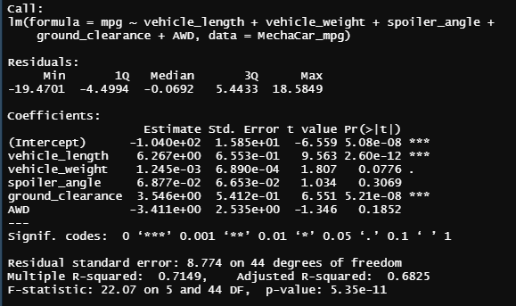

# MechaCar Statistical Analysis
Columbia Data Science Module 15


## Linear Regression to Predict MPG
After reading the .csv into R, I used the code below to run a linear regression on vehicle_length, vehicle_weight, spoiler_angle, ground_clearance, and AWD to see which variables help predict MPG. 

```
summary(lm(mpg~vehicle_length + vehicle_weight + spoiler_angle + ground_clearance  + AWD, MechaCar_mpg))
```
This yielded the summary table below: 



The analysis shows three variables that are clearly connected to MPG, all being significant at the 5σ-level, p = 3×10<sup>-7</sup>. T-values this high show an extremely strong statistical correlation: we would only expect these results to occur by random chance one in 3.5 million times.

Vehicle weight also shows a correlation with MPG, however, at a much reduced significance levels compared to the aforementioned variables. Vehicle weight is only significant at the p = .1 level. Spoiler agle and AWD were not statistically significant, so any correlation with MPG may be due to randomness. 

The slope of the linear model is not 0, as none of the variable slopes (everything in the 'Estimate' column except (Intercept) are 0.

The linear model effectively predicts MPG: R = .826, indicating a strong positive correlation. The Adjusted R<sup>2</sup> = .06825, indicating that 68.25% of the variation in MPG can be explained by the variation in the variables used.
